Homework 3
================
2023-03-20

# Question 1

1.  Simply running “Crime” on “Police” regression to infer causality
    ignores the common correlation vs causation fallacy. It isn’t
    unreasonable to conclude that high crime places would warrant high
    amounts of police, in which case the regression would suggest that
    high police numbers result in high crime. Obviously, that wouldn’t
    be the case.

2.  The reason the suggested regression above will provide false results
    is because of the inability to observe the counter-factual, since it
    isn’t likely to observe low crime areas that would have large
    amounts of police and vice versa. That is why the researchers had to
    get creative and try to find examples that would somehow mimic such
    counter factual. What they came up with is a pseudo counter-factual
    case of when Washington DC would add significant amounts of police
    that wouldn’t be warranted by the current crime rates in order to
    monitor any potential terrorist activity. Because the extra police
    presence wasn’t there due to the rise in crime, this research could
    be seen as deterministic of the causal relationship between crime
    and police presence. The table 2 of the research paper provides the
    results of such approach. The column of interest is the second one,
    as it controls for the Metro ridership (reason for it is answered in
    Question 3) According to the findings on high alert days (days with
    increased police presence due to high terrorist alert) there is a
    significant (on 5% level) drop in total number of daily crimes. On
    average the total number crimes drops by 6.046 crimes.

3.  The reason why the researchers had to control for Metro ridership is
    because the concern was that it is possible that on high alert days
    the number of potential crime victims was lower than on other
    typical days. Controlling for Metro ridership is how the researchers
    solved that problem. The thinking was that if high alert days would
    keep people inside their homes, then that would be reflected by the
    number of people riding the Metro. So, after controlling for that,
    the researchers still found significant reduction in crime with
    increased police presence that wasn’t there because the crime rates
    have gone up. This kind of thinking is what led to conclude that
    there is a potential causal relationship between high police
    presence and lower crime rates.

4.  Table 4 creates a further distinction in crime levels between parts
    of Washington DC, where there was greater police presence and the
    rest of the city. The dummy variable “District 1” in the model
    breaks down the data between the data points that belong to National
    Mall area (District 1) and the rest. Looking at the first column,
    the coefficients listed describe how the crime level changes on high
    alert days separated by geographical dummy variable. The results
    show that in the National Mall area, where police presence was
    higher than everywhere else in Washington DC, the total number of
    crimes dropped by 2.621, and the finding was significant on a 1%
    level. Everywhere else in DC (dummy variable = 0) the change in
    crime was not significant, suggesting that the increased police
    presence in District 1 did not have any impact on crime outside the
    National Mall area. All of the above results were controlled for the
    Metro ridership.

# Question 2

## Tree Modelling Dengue Fever

We begin by selecting the independent variables season, city,
precipitation, air temperature, specific humidity, dew point and
temperature range. Other variables were excluded due to similarity with
chosen variables or incomplete data.

## CART Tree

Next we make grow a CART tree keeping a minimum of 10 observations in
each leaf and prune it back.

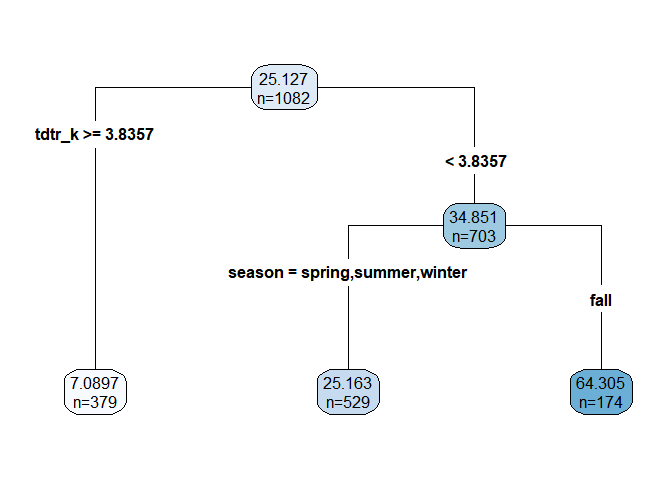<!-- -->

## Results

Here we use the test set to calculate our estimated RMSE

``` r
CART_RMSE
```

    ## [1] 40.93445

``` r
forest_RMSE
```

    ## [1] 40.38069

``` r
boost_RMSE
```

    ## [1] 39.69213

We note that all three methods yield very similar RMSE, this indicates
that all three our relatively similar in their predictive value. Since
the boosting model technically had the lowest RMSE, we will use this
model for our partial dependency plots.

## Partial Dependencies

Below we have the partial dependencies with respect to specific
humidity, precipitation and season.
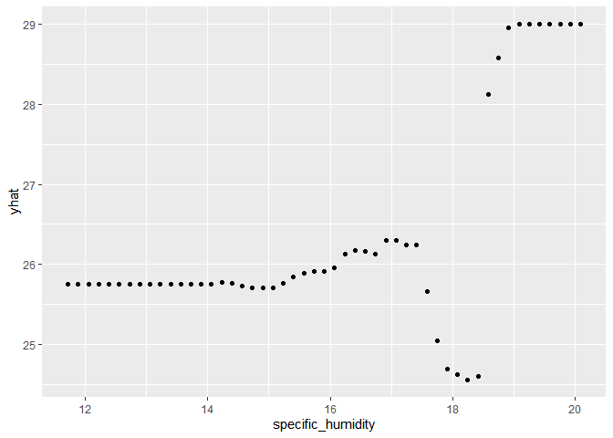<!-- -->

The specific humidity appears to have little effect on cases and any
effect it does have is inconsistent. Low predictions around a humidity
of 18 is possibly a real effect as a substantial portion of data falls
in this range but high predictions around a humidity of 19-20 are more
likely to be noise.

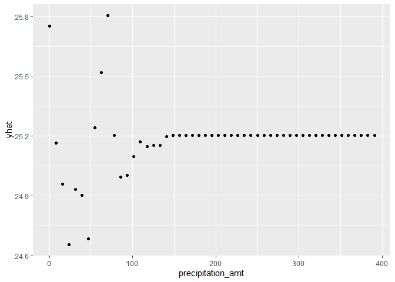<!-- -->

The precipitation plot indicates little to no effect on the number of
cases. The variation at low levels is almost certainly our model picking
up noise.

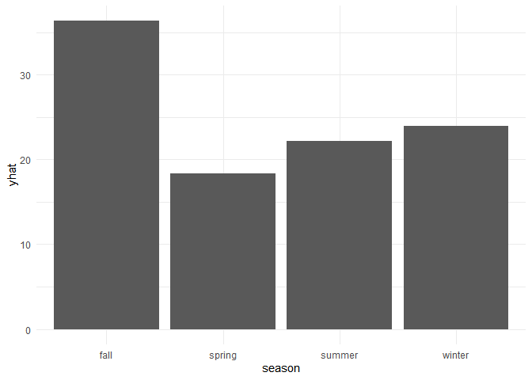<!-- -->

The above bar plot shows that summer and winter are the worst seasons
for dengue, followed by spring, followed by fall. It is unclear why two
opposite seasons would have the highest expected cases, but there is
likely something in the fall related to human activity or mosquito
breeding that inhibits dengue cases.

# Question 3

## Green Buildings Prediction

### Using basic regression and step functions

For the purposes of this model, we chose to include 12 elements/element
combinations for our prediction of revenue. The most important to answer
the question is green rating, which tells if the building in question
either LEED- or EnergyStar-certified. We also chose to include variables
measuring utility cost, as well as if those costs are placed on the
tenant or the landlord. We declined to include rent and leasing rate
because our outcome variable, revenue, is the product of those two
variables. As such, including them in the model as independent variables
would result in perfect multicollinearity. We also looked at measures
such as the age, renovations, and amenities near the building. The
initial lm model that provided reasonable RMSE was:

$Revenue_i$ = $\beta_0$ + $\beta_1BuildingSize$ +
$\beta_2EmploymentGrowth$ + $\beta_3Age$ + $\beta_4Renovated$ +
$\beta_5Renovated*Age$ + $\beta_6GreenRating$ + $\beta_7Amenitie$s +
$\beta_8DaysUtilitesUsed$ + $\beta_9GasCost$ +
$\{beta_10}ElectricityCost$ + \$\_{11}UtilitiesPaidBy \$

Starting with this base model, we measured the RMSE using a
training/test split on the data. Then, in order to test different
variations of the model, we used step() to measure various interactions
on the data. The coefficients that were significant and therefore
included in the model are shown below, as well as their coefficients.
The RMSE of this model is lower than just the base model, but it still
seems as though we could do better. In order to test this, we move into
forest and boosted models.

    ## lm(formula = revenue ~ size + empl_gr + stories + age + renovated + 
    ##     green_rating + amenities + total_dd_07 + net + age:renovated + 
    ##     stories:age + stories:renovated + stories:amenities + age:amenities + 
    ##     empl_gr:age + renovated:amenities + empl_gr:stories + size:age + 
    ##     size:green_rating + age:green_rating + size:net + size:renovated + 
    ##     stories:net + age:total_dd_07 + size:total_dd_07 + total_dd_07:net + 
    ##     empl_gr:net + empl_gr:total_dd_07 + empl_gr:green_rating + 
    ##     age:net + stories:age:renovated + age:renovated:amenities, 
    ##     data = gb_train)

    ##             (Intercept)                    size                 empl_gr 
    ##            2.995244e+03            2.137133e-03           -5.806116e+01 
    ##                 stories                     age               renovated 
    ##           -1.836132e+01           -6.759475e+00           -1.026181e+02 
    ##            green_rating               amenities             total_dd_07 
    ##           -1.195398e+02            8.928048e+02           -1.787544e-01 
    ##                     net           age:renovated             stories:age 
    ##           -7.713339e+02            5.512553e+00            1.713628e+00 
    ##       stories:renovated       stories:amenities           age:amenities 
    ##           -1.146404e+01           -3.173558e+01           -1.222965e+01 
    ##             empl_gr:age     renovated:amenities         empl_gr:stories 
    ##           -3.769669e-01           -1.655897e+02           -6.430752e-01 
    ##                size:age       size:green_rating        age:green_rating 
    ##           -1.492644e-05           -5.624393e-04            9.738888e+00 
    ##                size:net          size:renovated             stories:net 
    ##           -1.978204e-03            5.945054e-04            3.433055e+01 
    ##         age:total_dd_07        size:total_dd_07         total_dd_07:net 
    ##           -7.135449e-04           -7.250376e-08            1.130726e-01 
    ##             empl_gr:net     empl_gr:total_dd_07    empl_gr:green_rating 
    ##           -8.809931e+01            1.153375e-02            1.329199e+01 
    ##                 age:net   stories:age:renovated age:renovated:amenities 
    ##            6.264622e+00           -9.594217e-01            9.480374e+00

### Using Tree/Boosted Models

In order to use the tree modelling, we measure a random forest model
using the same base model that we measured above. We also tested a
boosted model with an interaction depth of 4 and 200 trees. From these
models, it is clear that the model with the lowest RMSE is the random
forest model. A table showing the RMSE of each prediciton method is
shown below.

| med_error | step_error | rmse_forest | rmse_boost |
|----------:|-----------:|------------:|-----------:|
|  1542.629 |    1477.97 |      763.29 |    1145.77 |

### Partial Dependence - The Importance of the Green Rating

From this plot, it does appear as though green rating does cause an
increase in revenue - however, a rating of 1 only increases revenue
about \$100 from a rating of 0, so it is clearly not the most important
variables.

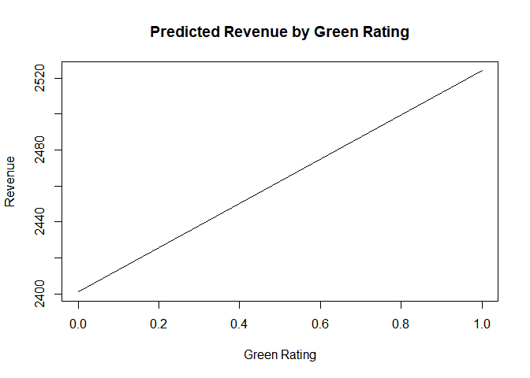<!-- -->

The following variable importance plot helps us measure which variables
are very important in terms of prediction. In terms of increasing the
RMSE, age, size, employment growth, and days that utlities were used are
very important to predict this model. We can also see that green rating
is one of the less important prediction variables.

### Conclusion

From these test, it seems as though the forest model provided the best
RMSE in terms of of overall revenue prediction. The green rating of a
building does not impact the revenue very much at all.

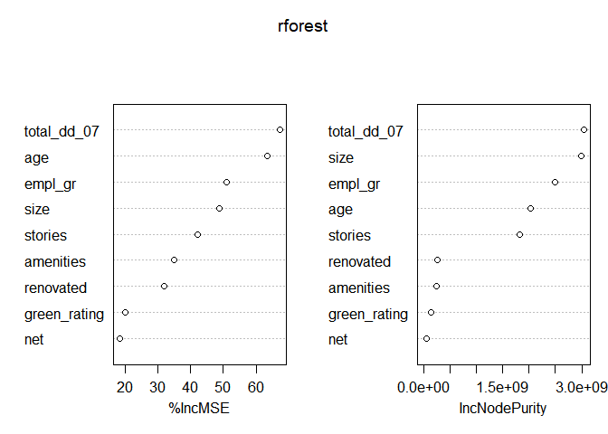<!-- --> \#
Question 4

To find our best predictive model, we elected to use three different
methods. Since our total number of features isn’t that high - only 9
after standardizing by household. For that reason some version of a tree
model is likely to work best.

To test that approach we also included a linear model to compare
against.

The first model we attempt is a Random Forest Model, which we then
compare to the General Boosted Regression approach.

## Random Forest Model

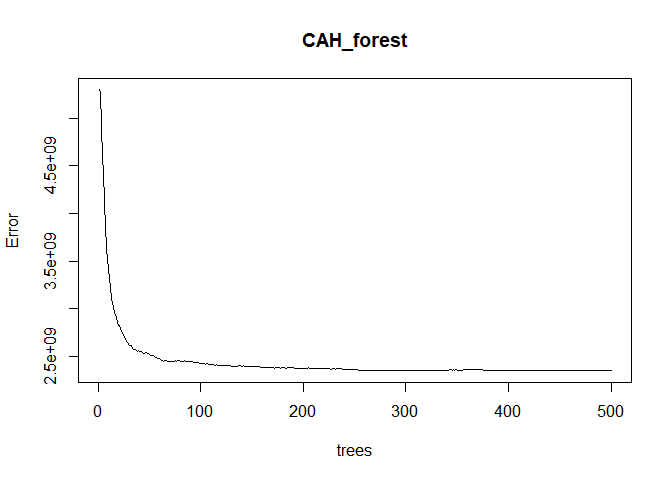<!-- -->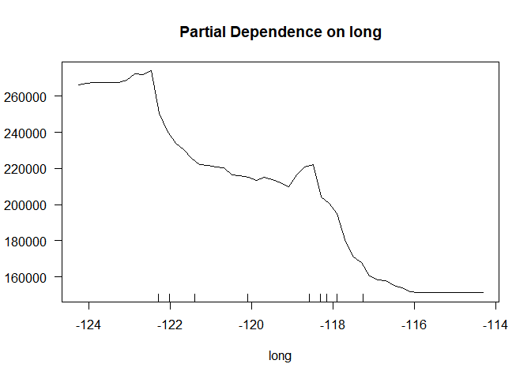<!-- -->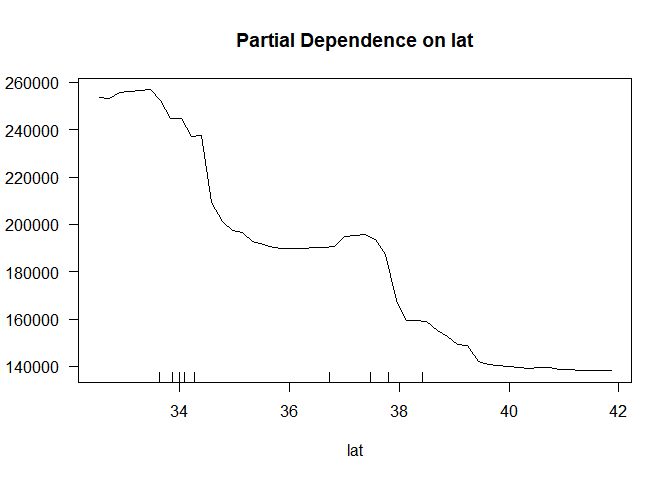<!-- -->

## General Boosted Regression Model

We make a build set and a check set to adjust parameters.

    ## Distribution not specified, assuming gaussian ...

    ## Distribution not specified, assuming gaussian ...

    ## Distribution not specified, assuming gaussian ...

    ## [1] 47581.17

    ## [1] 47431.42

    ## [1] 31087.47

After adjusting the parameters, we conclude that the interaction depth
of 12 is most optimal.

## Plot of predictions for y given location

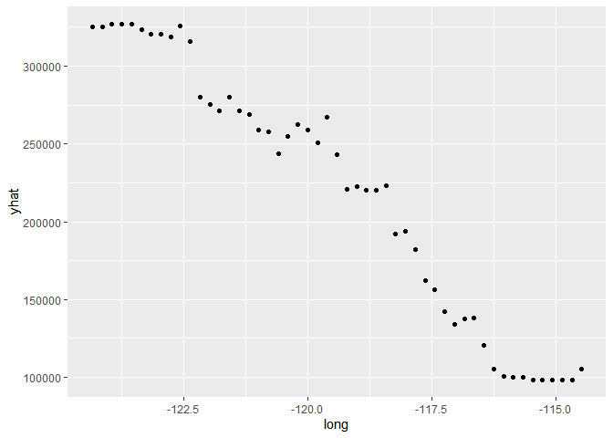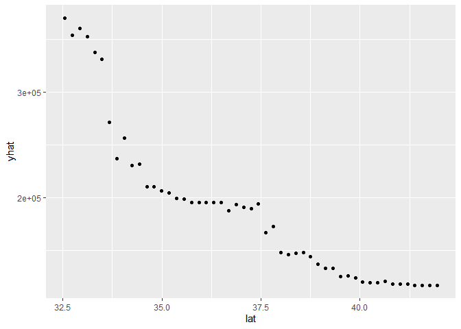
As a comparison, we also added a linear model.

## Linear model

    ## 
    ## Call:
    ## lm(formula = medianHouseValue ~ housingMedianAge + medianIncome + 
    ##     avg_rooms + avg_bedrooms + avg_house_pop + long + lat, data = CAH_train)
    ## 
    ## Residuals:
    ##     Min      1Q  Median      3Q     Max 
    ## -628222  -45992  -13129   31460  482749 
    ## 
    ## Coefficients:
    ##                    Estimate Std. Error t value Pr(>|t|)    
    ## (Intercept)      -3695721.7    76242.3 -48.473  < 2e-16 ***
    ## housingMedianAge      942.8       48.5  19.438  < 2e-16 ***
    ## medianIncome        44001.7      489.4  89.905  < 2e-16 ***
    ## avg_rooms          -11052.4      693.5 -15.938  < 2e-16 ***
    ## avg_bedrooms        62479.3     3183.8  19.624  < 2e-16 ***
    ## avg_house_pop        -919.8      117.3  -7.844 4.65e-15 ***
    ## long               -43402.5      869.9 -49.896  < 2e-16 ***
    ## lat                -41812.6      828.2 -50.486  < 2e-16 ***
    ## ---
    ## Signif. codes:  0 '***' 0.001 '**' 0.01 '*' 0.05 '.' 0.1 ' ' 1
    ## 
    ## Residual standard error: 71960 on 15472 degrees of freedom
    ## Multiple R-squared:  0.6117, Adjusted R-squared:  0.6116 
    ## F-statistic:  3483 on 7 and 15472 DF,  p-value: < 2.2e-16

Finally we compared the out-of-sample error for the 3 approaches against
our test set.

## RMSE test

    ## Using 1000 trees...

    ## [1] 45861.09

    ## [1] 48962.5

    ## [1] 74723.21

After comparing RMSE values between GBM, RandomForest and linear models,
the lowest RMSE value belongs to our GBM model.

GBM That will act as our best predictive model, which provided the
following results.

## Plot of the Original Data

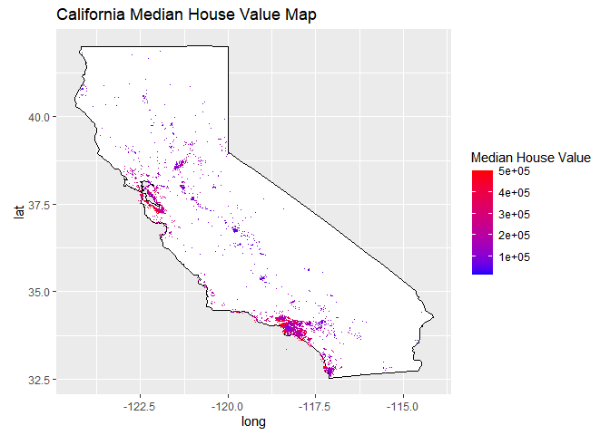<!-- -->

## Plot of our best Prediction Model

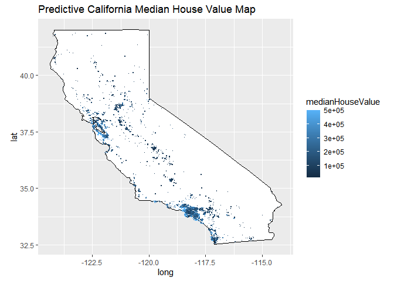<!-- -->

## Error/residuals Plot

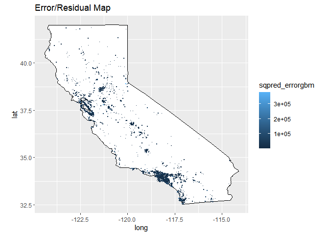<!-- -->
